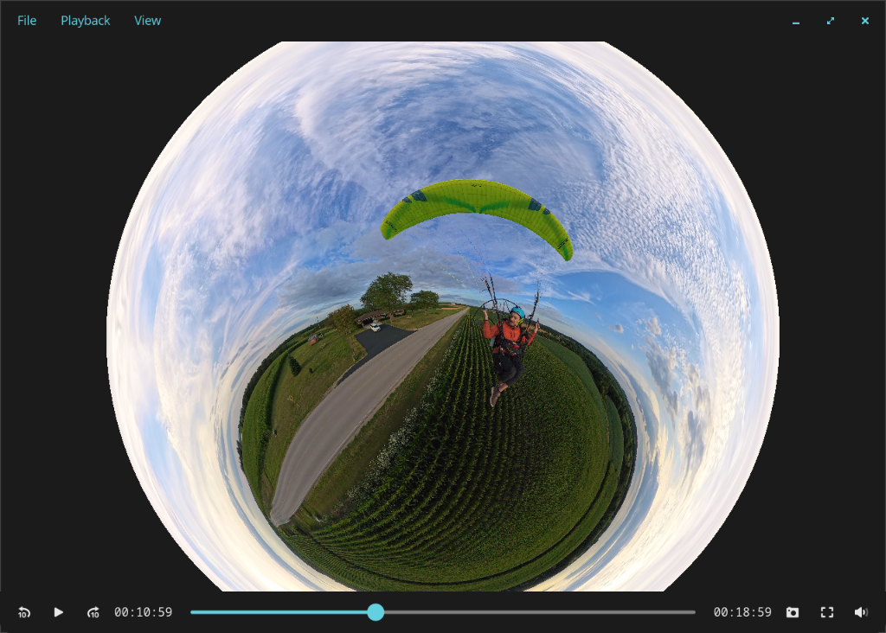

<p align="center">
  
</p>

<h1 align="center">Kjerag</h1>

<p align="center">Native 360° video player for the COSMIC desktop, written in Rust.</p>

<p align="center">
  
</p>

Kjerag plays Insta360 `.insv` files directly: open the file straight off
the camera and press play. Zero configuration.

## Features

- Drag to reframe, scroll to zoom
- Gyro horizon lock
- Automatic GPU stitching and lens color matching on supported cameras
- Temporal filtering to reduce flickering seam differences
- Screenshots
- Copyable view references
- Zero-copy hardware decode

## Install

[**Install Kjerag**](https://kjerag.harding.dev/stable.flatpakref)
in COSMIC Store, GNOME Software or Discover. One click, and updates arrive
with everything else.

Or two lines in a terminal:

```sh
flatpak remote-add --if-not-exists kjerag https://kjerag.harding.dev/kjerag.flatpakrepo
flatpak install kjerag dev.harding.Kjerag
```

Every build is GPG signed. Single-file bundles, for a machine that should not
carry a remote, are attached to each
[release](https://github.com/aeharding/kjerag/releases).

## Status

Beta.

| Camera | Support |
|---|---|
| Insta360 X4 Air | ✅ Tested with real footage |
| Insta360 ONE X2 | ✅ Tested with real footage |
| Insta360 X3, X4, X5 | ⚠️ Unverified |
| DJI Osmo 360 `.osv` | Basic calibrated playback; not the shared stitcher |
| Other DJI, GoPro | ❌ Not supported |

The shared stitcher is verified on ONE X2 and X4 Air footage, not every
recording mode or camera firmware. Stitching is Studio-like, not identical:
seams and differences in noise or moving detail can remain. Playback requires
working VA-API hardware decoding and a compatible Vulkan GPU. There is no
software-decoding fallback.

Existing Osmo 360 playback is separate from this Insta360 stitching work and
is not requalified by it. Open `.osv` files from the command line or by dropping
them into the player; the current file chooser filters for `.insv`.

Have a camera that is unverified or missing?
[Open an issue](https://github.com/aeharding/kjerag/issues) with a short
raw clip straight off the camera.

Releases carry an x86_64 and an aarch64 build. The aarch64 one is compiled
and unit tested in CI and has never been run on aarch64 hardware; reports
are welcome in the same place.

See [docs/ROADMAP.md](docs/ROADMAP.md) for where things stand and
[docs/ARCHITECTURE.md](docs/ARCHITECTURE.md) for how it works.

## Why

Insta360 Studio has no Linux build, and nothing on Linux plays raw `.insv`
with calibrated reframing: VLC only handles pre-stitched equirectangular,
and mpv shader hacks have no lens calibration, seam blending, or horizon
lock. The gap is real; this fills it.

## How

An X4-class `.insv` is an MP4 carrying two 3840×3840 HEVC streams (one per
lens) plus a metadata trailer with full per-lens calibration (Mei/UCM
model), raw gyro, and per-frame exposure. Kjerag decodes both streams via
VA-API and imports the frames into wgpu through dmabuf, without a CPU pixel
copy. Supported cameras share a GPU stitching engine with camera-specific
calibration. Alignment, lens color matching and temporal filtering run once per
source frame, independently of view redraws; GPU-owned pictures and correction
fields are reused when the view moves. The final reframed view is drawn in one
render pass.

Opening or seeking prepares the first complete picture before playback starts.
Seeking restarts stitching history, so its first pictures can differ slightly
from uninterrupted playback. GPU rendering capacity and the display's refresh
rate are separate limits; see the bounded measurements and remaining
limitations in [the merge qualification record](docs/MERGE_READINESS.md).

## License

AGPL-3.0-only. Temporal motion-search code includes adaptations of MVTools by
Manao and A. G. Balakhnin (Fizick), with per-file attribution and the elected
[GPL-3.0-or-later license](crates/render/src/temporal_fusion/LICENSE-MVTOOLS).
The local iced dependencies retain their MIT licenses and documented patches
under `vendor/`. Projection math follows the published Mei/OpenCV-omnidir
description of the lens model.
